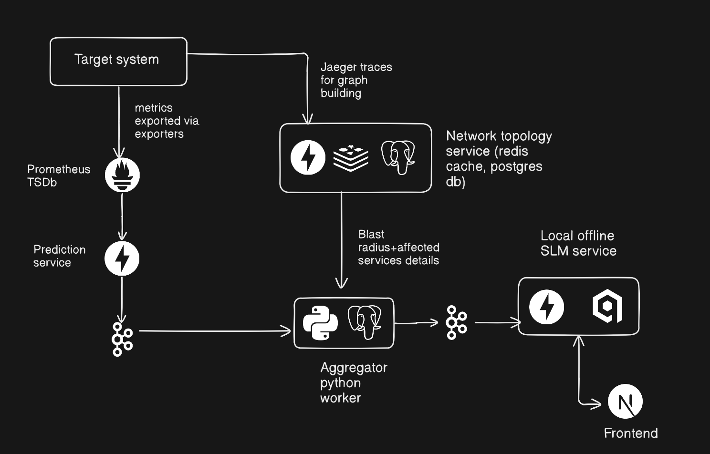

# Reliq
An air-gapped operational intelligence stack that forecasts service degradation, computes blast radius using dependency graphs, and assists operators with AI-powered incident analysis.
## Unique Features
1. Built for secure internal platforms, this stack runs locally, without any cloud dependency
2. This stack can be used locally in a k8s cluster, by installing the helm chart of this stack
## Architecture Diagram

## Tech stack
1. Time-series database: Prometheus
2. Vector database: QDrant
3. Incident storage: PostgreSQL
4. Backend services: FastAPI
5. Local SLM: phi-3.5-mini
6. Queue system: Kafka
## Status
1. storing snapshots in PostgreSQL database done
2. Next task: Creating a test microservice product for testing and custom dataset creation for ML model

